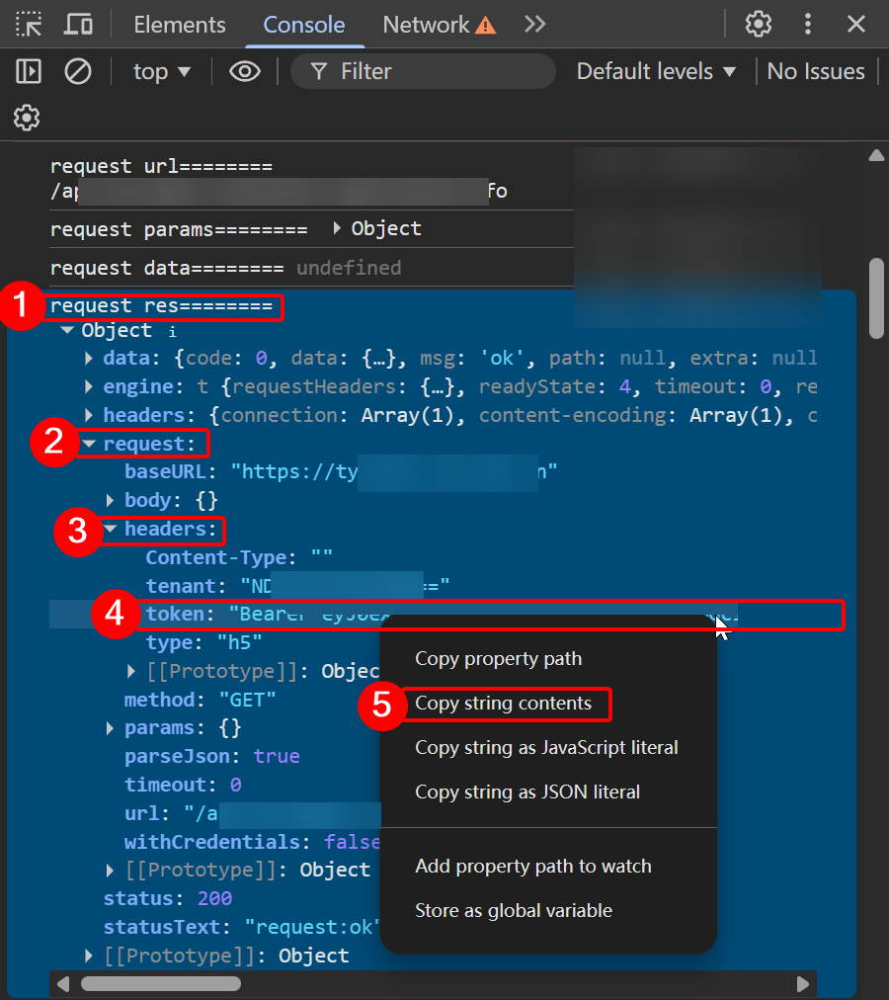
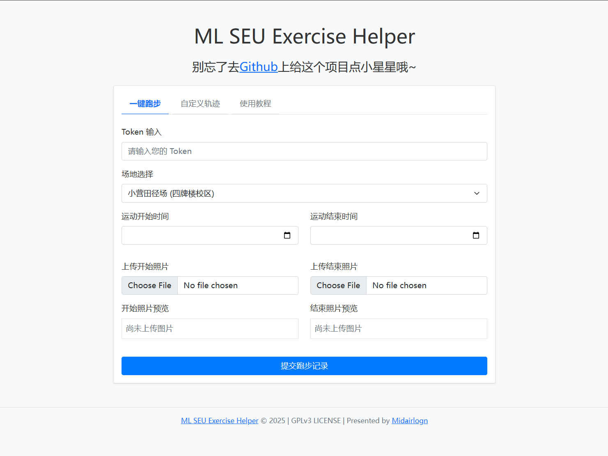

# SEU Run Assistant

> 基于 [harkerhand/ML-SEU-Exercise-Helper](https://github.com/harkerhand/ML-SEU-Exercise-Helper) 改进的东南大学课外锻炼助手。
> 原版作者：[Midairlogn](https://github.com/midairlogn)，本版在其基础上进行了功能扩展和体验优化。遵循 [GPLv3 许可证](LICENSE)。

---

## 和原版相比，多了什么？

| 功能 | 原版 | 本版 |
|------|------|------|
| 单次提交跑步记录 | ✅ | ✅ |
| Token 认证 / 场地选择 | ✅ | ✅ |
| 手动设置起止时间 | ✅ | ✅ |
| 开始 / 结束照片上传 | ✅ | ✅ |
| **随机轨迹生成**（7 个场地，含边界检测） | ❌ | ✅ |
| **随机时间 + 配速 / 距离联动** | ❌ | ✅ |
| **批量提交**（按日期范围，可跳过周末） | ❌ | ✅ |
| **照片池**（批量模式随机取图） | ❌ | ✅ |
| **随机场地**（每天自动换场地） | ❌ | ✅ |
| **课表 CSV 导入 / 粘贴识别** | ❌ | ✅ |
| **导入后课表时间可直接修改** | ❌ | ✅ |
| **批量失败记录 + 重新提交失败日期** | ❌ | ✅ |
| **提交前本地校验**（Token 格式、时间范围、照片） | ❌ | ✅ |
| **结果反馈弹窗**（成功 / 失败 / 原因摘要） | ❌ | ✅ |
| **使用教程页**（含 Token 获取方法） | ❌ | ✅ |

简单说：原版是一个提交表单，本版是一套完整的批量锻炼记录工具。

---

### **🔥 可以补之前的跑步记录，也可以超前跑！**

---

## 快速开始

1. 直接用浏览器打开 `index.html`（推荐电脑端）
2. 按页面步骤操作即可

> **需要校园网**，在成功提示弹出前不要离开或关闭页面。

### Token获取说明
> Token形如 `Bearer [part1].[part2].[part3]`。

1. 打开 [https://tyxsjpt.seu.edu.cn/h5/#/pages/home/index](https://tyxsjpt.seu.edu.cn/h5/#/pages/home/index) ，登录账号。

2. 按 `F12` (有的电脑是 `Fn + F12` )打开浏览器的开发人员工具，进入 `控制台` ( `console` )。

3. 展开 `request res========` 后面的 `object` ，找到 `request.headers.token` 。

4. 右键复数字符串内容。**注意: 不需要引号!**

### 单次提交

1. 填入 Token
2. 选择场地 → 点击「随机轨迹」
3. 点击「随机时间」或手动设置
4. 上传两张自拍照片（开始 / 结束）
5. 提交

### 批量提交

1. 切换到「批量上传」标签页
2. 填 Token → 选日期范围（可跳过周末）
3. 上传照片池（开始和结束各至少一张）
4. 开始批量提交

> 照片用自拍，人脸尽量占满画面，可以重复使用同一张。

---

## 支持的场地（7 个）

- 橘园田径场
- 桃园田径场
- 梅园田径场
- 丁家桥体育场
- 四牌楼体育场
- 小营田径场
- 无锡国际校区体育馆

---

## 声明

- 本项目基于 [harkerhand/ML-SEU-Exercise-Helper](https://github.com/harkerhand/ML-SEU-Exercise-Helper) 开发，原版作者 [Midairlogn](https://github.com/midairlogn)
- 遵循 [GPLv3 许可](LICENSE)：可自由使用、修改、分发，但修改后的版本必须同样在 GPLv3 下开源
- 反对任何形式的商业化使用（收费服务、出售代码等）

**软件按"原样"提供，不附带任何担保。作者不对因使用本软件产生的任何直接或间接损失、数据丢失、法律责任或其他风险承担责任。**

**用户应对其上传的数据承担全部责任，确保其符合实际情况。**
