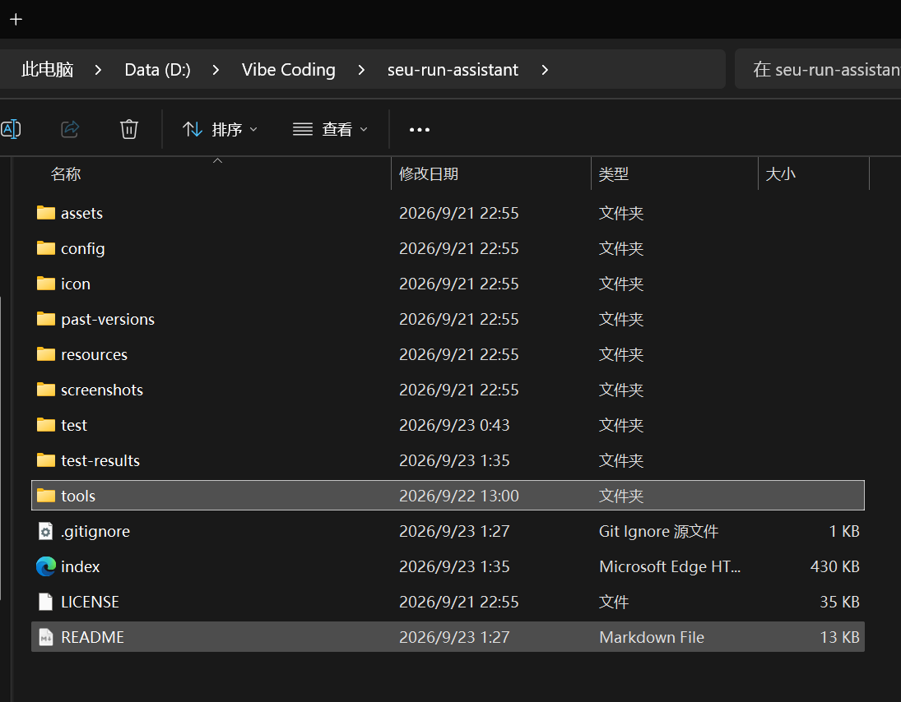
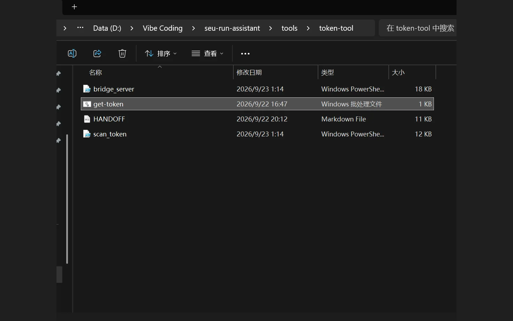

# SEU Run Assistant

东南大学课外锻炼记录助手。在网页上填写跑步记录，自动生成符合规则的轨迹、时间、配速，一键提交。
可以补录之前的记录。

> 原作者 Midairlogn，现维护仓库 [harkerhand/ML-SEU-Exercise-Helper](https://github.com/harkerhand/ML-SEU-Exercise-Helper)。
> 本版在其基础上改进，遵循 [GPLv3 许可证](LICENSE)。

---

## 三步上手

**1. 打开页面**
双击根目录的 `index.html`，用 Chrome 或 Edge 打开。不需要安装任何东西。

**2. 启动桥接服务**
双击 `tools/token-tool/get-token.bat`，会弹出一个黑色窗口。**这个窗口全程不要关**——网页读取
Token 和提交记录都要经过它。

**3. 提取 Token**
在微信里打开「东南大学体育管理 → 阳光跑」，点进任意一个会加载数据的页面，然后回到网页点
「从微信小程序提取 Token」，Token 会自动填入。

> **需要校园网。** 在弹出成功提示之前，不要关闭页面或桥接窗口。

---

## 提交一次记录

1. **填入 Token**（上一步已自动填入）
2. **选择运动场地** —— 填入 Token 后会自动加载当前可用的场地
3. **点「一键生成时间+轨迹」** —— 自动生成符合规则的时间、距离、配速，也可以手动改
4. **上传两张自拍**（开始一张、结束一张）
5. **点「提交跑步记录」**

提交时会依次显示检查、上传、等待状态，最后弹出结果。以成功提示为准。

## 批量补录

1. 切到「批量记录」标签页
2. 填入 Token，选择日期范围（可以跳过周末）
3. 上传照片池（开始和结束各至少一张）
4. 点「开始批量提交」

批量过程中会逐天显示进度，失败的日期会列出来，可以点「重新提交失败日期」重试。

---

## 注意事项

**不能提前跑。** 开始时间必须早于当前时间——日期选择器只能选到今天，时间生成器也不会产出未来的时间。
如果选到了未来的时间，提交前会直接拦下并提示。**补录过去的记录不受影响。**

**同一天只算一次。** 当天已经有记录时（哪怕那条是无效的），再提交也不会被计入。页面在提交前会
自动检查，单次提交会直接拦下并说明原因，批量提交会跳过那一天并写在失败列表里。

**照片用自拍。** 人脸尽量占满画面，开始和结束可以用同一张。

**「模拟间隔」可以设成 0。** 默认 5 秒，是开始记录和结束记录之间的等待；设成 0 提交最快。

**别忘了看「我的锻炼记录」。** 页面上有一块折叠面板，展开后能看到当月每一条记录和它的状态
（✅ 有效 / ❌ 无效）。有效的才计入次数。

---

## 常见问题

| 现象 | 原因和处理 |
|------|-----------|
| 提示「无法连接本地桥接服务」 | 桥接窗口没开，或者被关了。重新双击 `get-token.bat` |
| 提示「请先填入 Token 加载场地」 | 还没提取 Token，按上面第 3 步操作 |
| 提取 Token 很慢（十几秒） | 微信里还没打开过会加载数据的页面。先进「阳光跑」点开一个页面，再回来提取 |
| 提交后显示无效 | 当天已经有记录了，或者照片没通过人脸核验 |
| 提示 Token 无效 / 401 | Token 过期了，重新提取一次 |

---

## 和原版相比，多了什么？

| 功能 | 原版 | 本版 |
|------|------|------|
| 单次提交跑步记录 · Token 认证 · 场地选择 · 照片上传 | ✅ | ✅ |
| 轨迹生成（自动贴合场地形状） | ❌ | ✅ |
| 时间 / 距离 / 配速自动对齐 | ❌ | ✅ |
| 批量提交（按日期范围，可跳过周末） | ❌ | ✅ |
| 照片池、随机场地 | ❌ | ✅ |
| 课表 CSV 导入 / 粘贴识别 | ❌ | ✅ |
| 提交前本地校验 | ❌ | ✅ |
| 我的锻炼记录（只读查看当月记录） | ❌ | ✅ |
| 使用教程页 | ❌ | ✅ |

简单说：原版是一个提交表单，本版是一套完整的批量锻炼记录工具。

## 支持的场地

场地由服务端实时下发，以页面「运动场地」下拉框为准。当前有 7 个：

九龙湖-桃园田径场 · 九龙湖-梅园田径场 · 九龙湖-橘园田径场 · 四牌楼-四牌楼田径场 ·
四牌楼-校东田径场 · 无锡校区 · 丁家桥校区

---

## 开发者

想了解接口对接、加密方式、跨域处理等技术细节，见 [PROTOCOL.md](PROTOCOL.md)；
本地辅助工具的实现与限制见 [tools/token-tool/HANDOFF.md](tools/token-tool/HANDOFF.md)。

## 声明

- 本项目基于 [harkerhand/ML-SEU-Exercise-Helper](https://github.com/harkerhand/ML-SEU-Exercise-Helper) 开发，原作者 Midairlogn
- 遵循 [GPLv3 许可](LICENSE)：可自由使用、修改、分发，但修改后的版本必须同样在 GPLv3 下开源
- 反对任何形式的商业化使用（收费服务、出售代码等）

**软件按"原样"提供，不附带任何担保。作者不对因使用本软件产生的任何直接或间接损失、数据丢失、法律责任或其他风险承担责任。**

**用户应对其上传的数据承担全部责任，确保其符合实际情况。**
